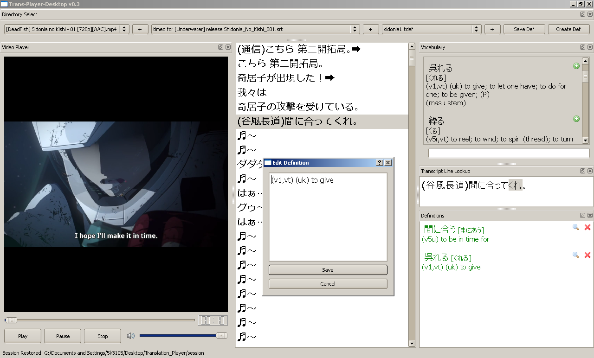

# Trans-Player-Desktop

Load japanese video file and 'srt' transcript file.
Interact with transcript file by looking up words with embedded yomichan dictionary.
Save and edit vocabulary words per transcript line.

Download link: https://www.dropbox.com/s/j5kg6q7b1tf1xg3/03172015.zip?dl=0

Older version: https://www.dropbox.com/s/sipivrhekvx30cc/translationplayer.zip?dl=0

Questions and comments: https://groups.google.com/forum/#!forum/translation-player

Japanese transcript resources:

Anime: http://kitsunekko.net/

Drama: http://jpsubbers.x10.mx/Japanese-Subtitles/

You can jump around the video by clicking on a line in the Transcript list (center). While the video is playing, the current transcript line is highlighted, following along with the video.

When you double click a Transcript line it will appear in the box 'Lookup Line'. From there you can mouse over the words while holding down SHIFT and it will look them up. This feature is forked from the Yomichan project (https://github.com/FooSoft/yomichan), an Anki plugin. 

When looking a word up in the dictionary, click the icon next to the correct definition to save it into the Definitions panel.

Definitions are saved per transcript line. When the line is selected through mouse click or video play, the saved definitions for that line appear in the Definitions panel.

Instructions:

First step is to select the video file folder. There are three combo boxes with little '+' buttons. The first box selects the video, the second box selects the transcript, the third selects definitions folder.

Set the base folder by pressing the + button. It will allow you to select the folder on your computer where the video is. Once done, open the combobox and select the correct video file. Do the same for the transcript. The transcript must end in .srt and timed for your video or it won't work.

The last combobox is for the saved defs. Buttons are provided to Create a new definition file and to Save the current file (as .tdef). Select folder ('+') to enable Create button. Once file is selected, Save button is enabled as well.

Press play to start the video. Spacebar to pause. Double click on video panel to toggle full screen (ESC to exit).

Before exit, click 'Save Def' to save the definitions you've set.

